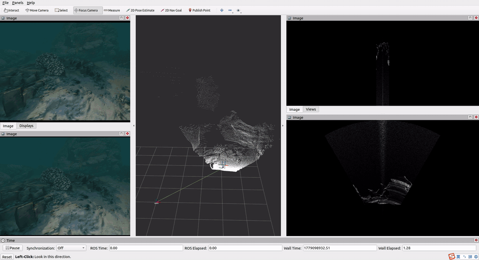

# SonarSweep Dataset Preparation

This repository converts ROS bags recorded in [OceanSim](https://github.com/LingpengChen/LIAS_oceansim) into a folder-based dataset for training and evaluating [SonarSweep](https://github.com/LIAS-CUHKSZ/SonarSweep). Each synchronized timestamp is exported as one datapoint folder containing stereo camera images, depth maps, sonar images, camera pose, camera intrinsics, sonar intrinsics, and the camera-to-sonar extrinsic transform.



## Dataset Layout

The expected raw data layout is:

```text
raw_dataset/
└── {sonar_type}/
    ├── {bag_name}.bag    # Recorded ROS bag dataset
    └── background.bag    # Empty-scene sonar background for denoising
```

The processed output layout is:

```text
processed_dataset/
├── {bag_name}.txt        # Datapoint folder names, one per line
└── {sonar_type}/
    ├── {bag_name}_0/     # First datapoint exported from {bag_name}.bag
    ├── {bag_name}_1/
    └── ...
```

## Recorded Topics

The simulator should publish the following topics:

```text
/isaacsim/camera/camera_info
/isaacsim/camera/depth/image_raw
/isaacsim/camera/image_raw
/isaacsim/camera2/depth/image_raw
/isaacsim/camera2/image_raw
/isaacsim/imu/data
/isaacsim/sonar_rect_image
/tf
/tf_static
```

In the simulator setup, the left camera is colocated with the sonar. The right camera is used as the main camera frame, so the converter saves `cam_right_pose.txt` and `T_camright2sonar.txt`.

This configuration is intentional: it verifies that SonarSweep can explicitly handle the sonar-camera extrinsic transform by warping sonar information into a camera frame located at a different position.

## Step 1: Record ROS Bags

Create a folder for the target sonar setting. In our real experiments, we use an M1200d sonar with a horizontal FOV of 60 degrees and a vertical FOV of 12 degrees in high-frequency mode, so the example folder is named `vfov12hfov60`.

You can also record data with other sensor settings, such as `vfov20hfov130`, by changing the sonar parameters in [OceanSim](https://github.com/LingpengChen/LIAS_oceansim).

```bash
mkdir -p raw_dataset/vfov12hfov60
cd raw_dataset/vfov12hfov60
```

Record the main dataset bag:

```bash
rosparam set use_sim_time false
rosbag record -O {bag_name}.bag \
  /isaacsim/camera/camera_info \
  /isaacsim/camera/depth/image_raw \
  /isaacsim/camera/image_raw \
  /isaacsim/camera2/depth/image_raw \
  /isaacsim/camera2/image_raw \
  /isaacsim/imu/data \
  /isaacsim/sonar_rect_image \
  /tf \
  /tf_static
```

A reference `test.bag` is provided for quick testing. You can download it with:

```bash
python3 download_rosbag.py
```

You can also download it manually from the [SonarSweep dataset page on Hugging Face](https://huggingface.co/datasets/Lingpenghaha/Sonarsweep_dataset/tree/main).

### Inspect a Recorded Bag

Run the following commands to inspect a recorded bag in RViz:

```bash
roscore
```

In a new terminal:

```bash
rviz -d config/config_isaacsim.rviz
```

In another terminal:

```bash
rosparam set use_sim_time true
rosbag play -l -r 10 raw_dataset/vfov12hfov60/test.bag
```

Optional helper scripts can publish the depth point cloud and Cartesian sonar image:

```bash
python3 publish_pcd.py
python3 publish_converted_sonar.py
```

## Step 2: Record and Extract Background Images

Record a background sonar bag with no foreground objects:

```bash
rosbag record -O background.bag /isaacsim/sonar_rect_image
```

The example background bag is already provided at:

```text
raw_dataset/vfov12hfov60/background.bag
```

The denoising pipeline uses an averaged empty-scene sonar background. Configure `base_dir` in `raw_dataset/retrieve_background_image.py`, then run:

```bash
cd raw_dataset
python3 retrieve_background_image.py
```

The averaged background image will be saved under:

```text
raw_dataset/{sonar_type}/background/
```

## Step 3: Configure Sonar Parameters

Edit `config/hyperparam.py` before conversion. The sonar parameters used by `test.bag` are:

```python
Min_range = 0.1
Max_range = 5.0
Range_res = 0.005
Img_height = 1000
Hori_fov = 60.0
Vert_fov = 12.0
Angular_res = 0.4
Img_width = 150
```

These values are also written into each datapoint as `sonar_intrinsic.txt`.

## Step 4: Convert Bags to Datapoints

Run the main converter from the repository root:

```bash
python3 rosbag2folders.py --sonar_type vfov12hfov60
```

By default, the converter reads:

```text
raw_dataset/vfov12hfov60/*.bag
```

It excludes `background.bag` and writes datapoints to:

```text
processed_dataset/vfov12hfov60/{bag_name}_{index}/
```

It also writes:

```text
processed_dataset/{bag_name}.txt
```

with one datapoint folder name per line.

You can override the input and output directories:

```bash
python3 rosbag2folders.py \
  --input_dir raw_dataset/vfov12hfov60 \
  --output_dir processed_dataset/vfov12hfov60
```

## Datapoint Contents

Each datapoint folder contains:

```text
cam_intrinsic.txt
cam_left.png
cam_right.png
depth_left.npy
depth_left_visualize.png
depth_right.npy
depth_right_visualize.png
cam_right_pose.txt
T_camright2sonar.txt
sonar_intrinsic.txt
sonar_rect.png
sonar.png
sonar_rect_denoise.png
sonar_denoise.png
```

### Camera Data

`cam_intrinsic.txt` stores the original camera intrinsic matrix.

`cam_right_pose.txt` stores the right camera pose in the world frame.

`T_camright2sonar.txt` stores the transform from the right camera frame to the sonar frame. The transform is expressed in the camera coordinate convention, where the z-axis points forward and the x-axis points right.

### Sonar Data

The raw simulator sonar image covers `Min_range` to `Max_range`. The converter pads the image so `sonar_rect.png` represents the full `0` to `Max_range` range.

`sonar.png` is a Cartesian visualization generated from the padded rectangular sonar image.

`sonar_rect_denoise.png` is the denoised rectangular sonar image, and `sonar_denoise.png` is its Cartesian visualization.

The denoiser uses the averaged background image from `raw_dataset/{sonar_type}/background/` and the SCUNet model at:

```text
denoise/model/scunet_gray_25.pth
```

## Step 5: Crop and Enhance Camera Images

After conversion, crop the camera and depth images to match the sonar FOV, then generate grayscale CLAHE-enhanced camera images for SonarSweep. SonarSweep uses a single-channel grayscale camera image with the same FOV as the sonar image.

```bash
python3 crop_and_enhance_images.py --sonar_type vfov12hfov60
```

This adds files such as:

```text
cropped_cam_intrinsic.txt
cropped_cam_left.png
cropped_cam_right.png
cropped_depth_left.npy
cropped_depth_right.npy
enhanced_gray_cam_left.png
enhanced_gray_cam_right.png
```

After these steps, the dataset is ready for sonar-camera fusion depth estimation with SonarSweep.

If you do not want to run the full preparation pipeline, you can directly download the prepared `vfov12hfov60` dataset from the [SonarSweep dataset page on Hugging Face](https://huggingface.co/datasets/Lingpenghaha/Sonarsweep_dataset/tree/main).
